# System Architecture Diagram

## High-Level Architecture

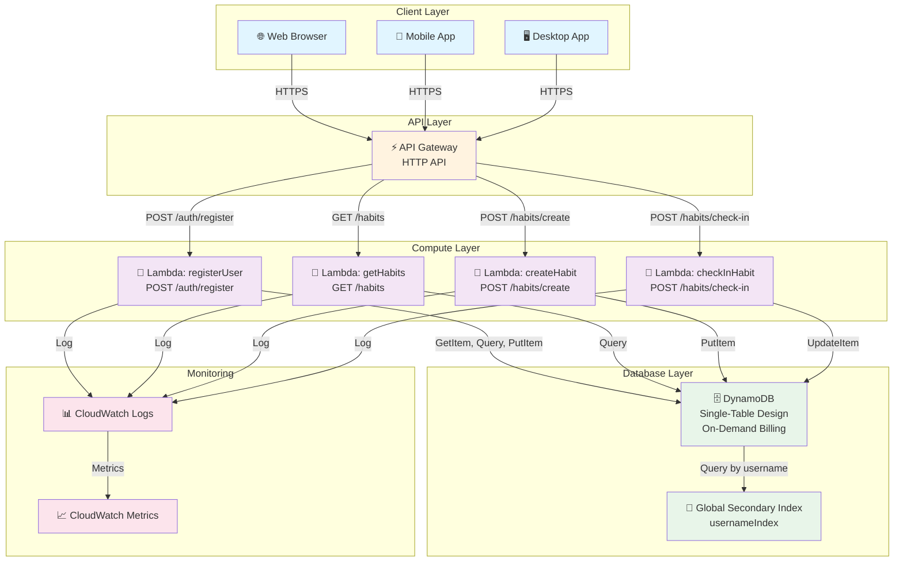

---

## Data Flow - User Registration

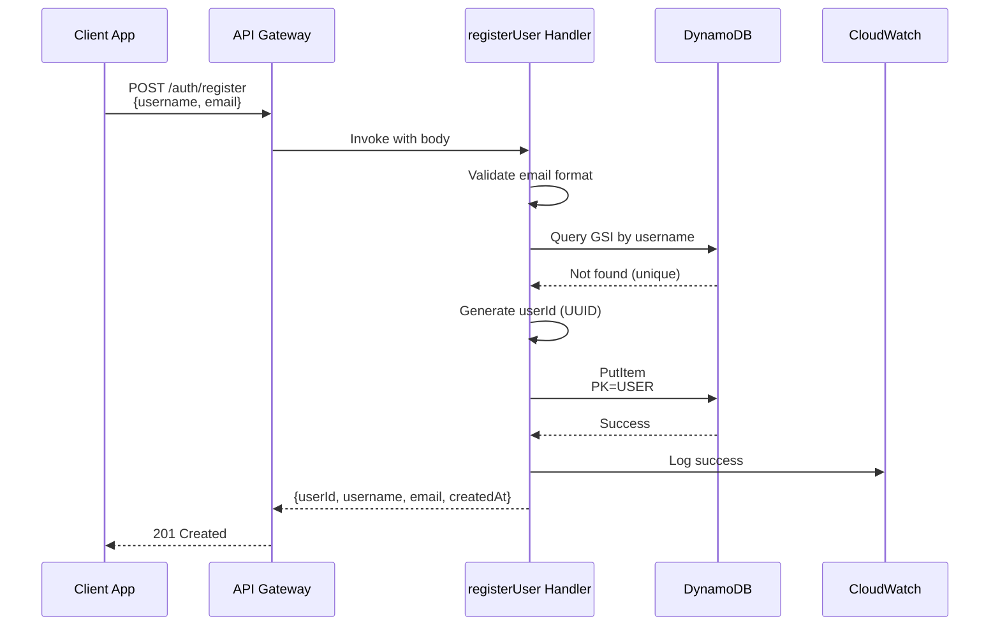

---

## Data Flow - Habit Creation

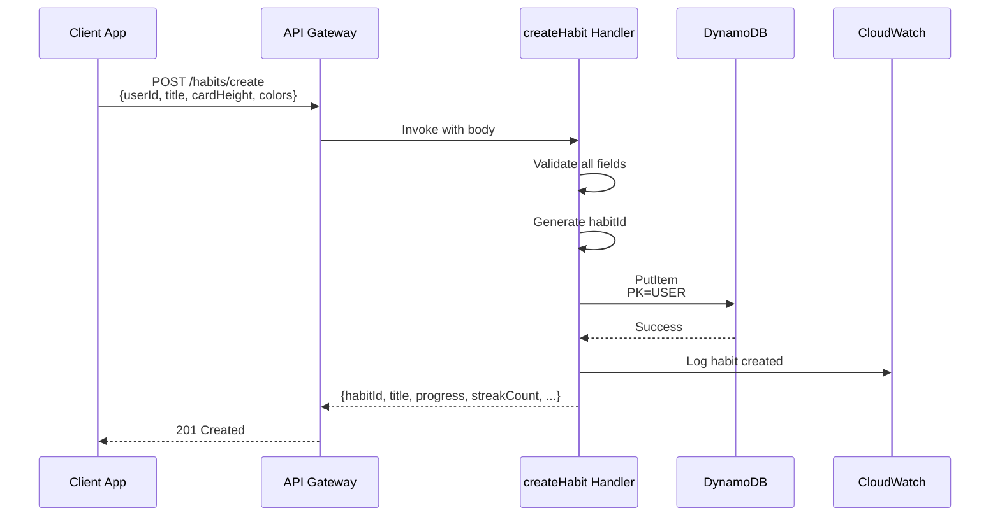

---

## Data Flow - Get Habits

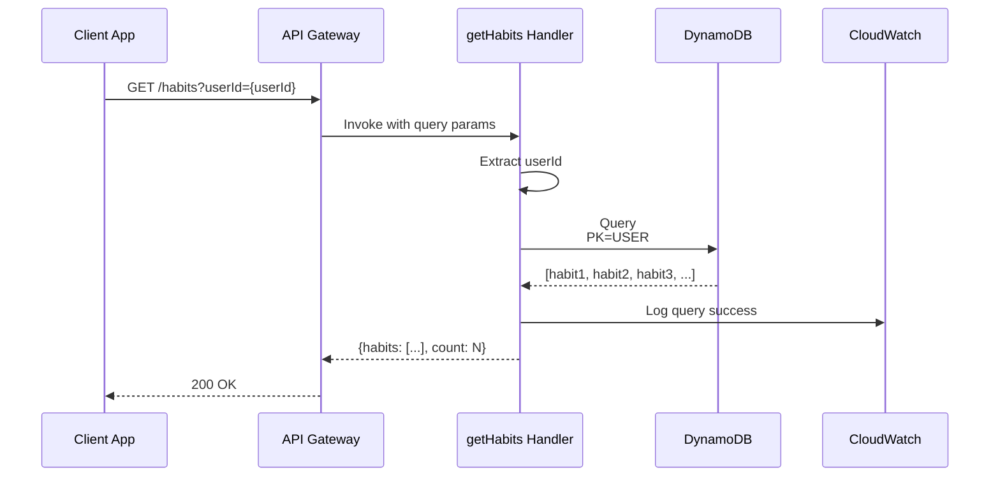

---

## Data Flow - Check-In (Atomic Operation)

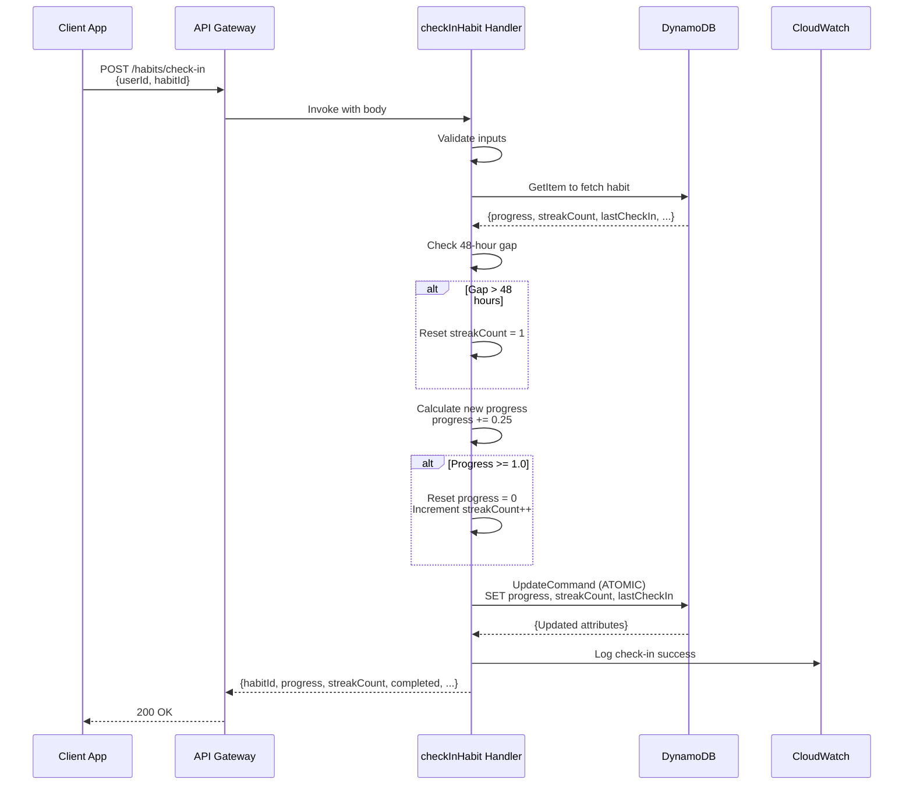

---

## DynamoDB Single-Table Design

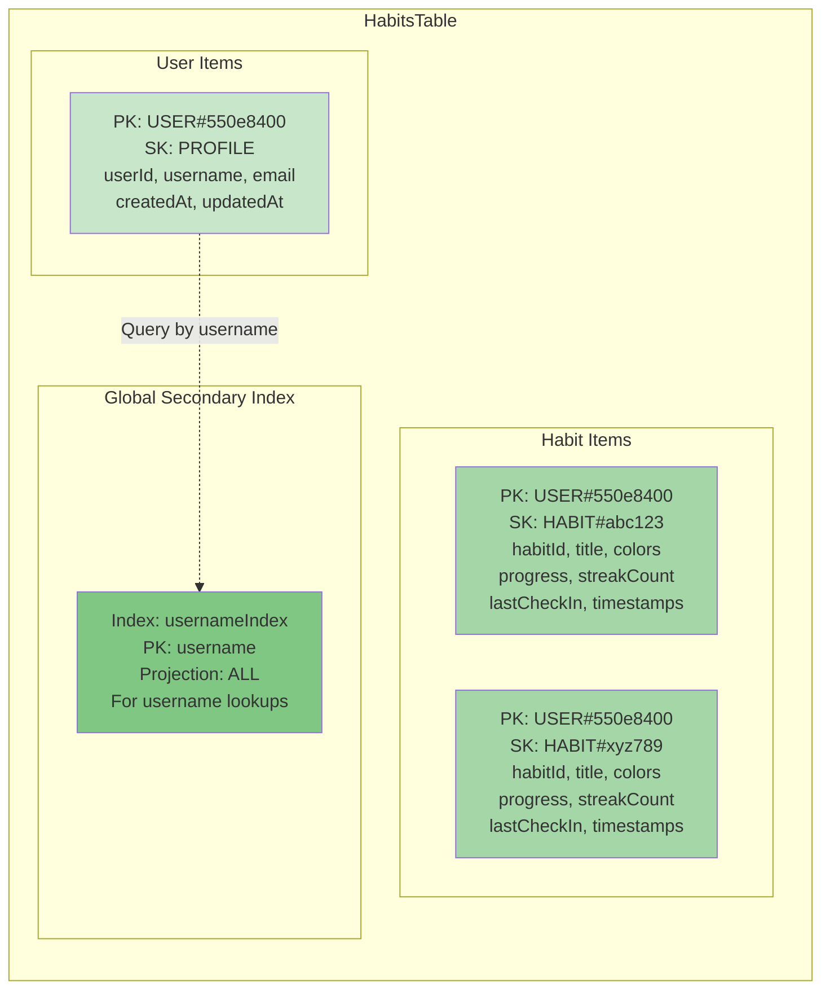

---

## Lambda Function Interaction

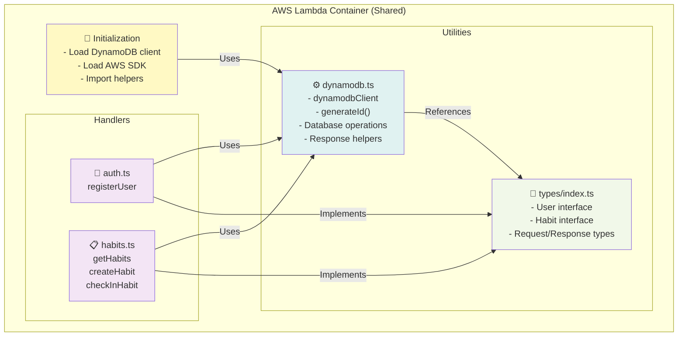

---

## Deployment Pipeline

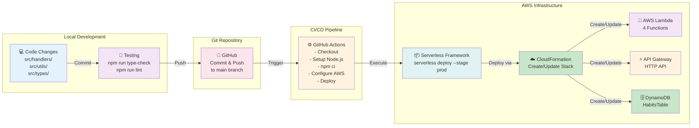

---

## Request/Response CORS Flow

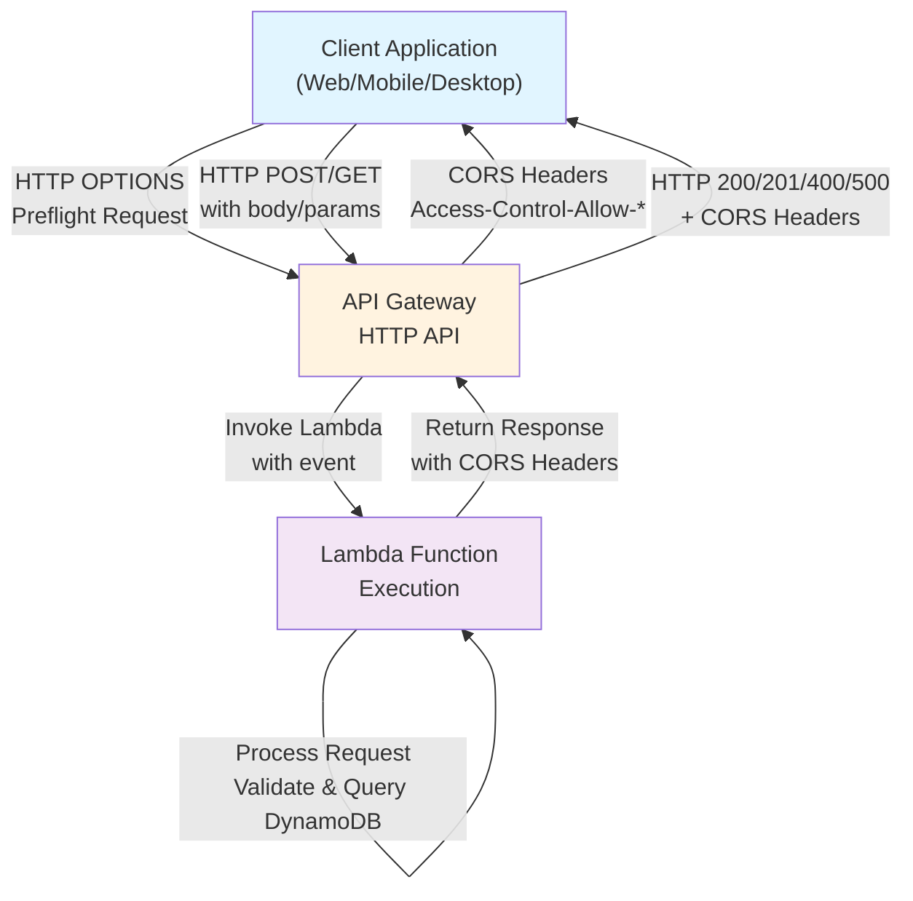

---

## Error Handling Flow

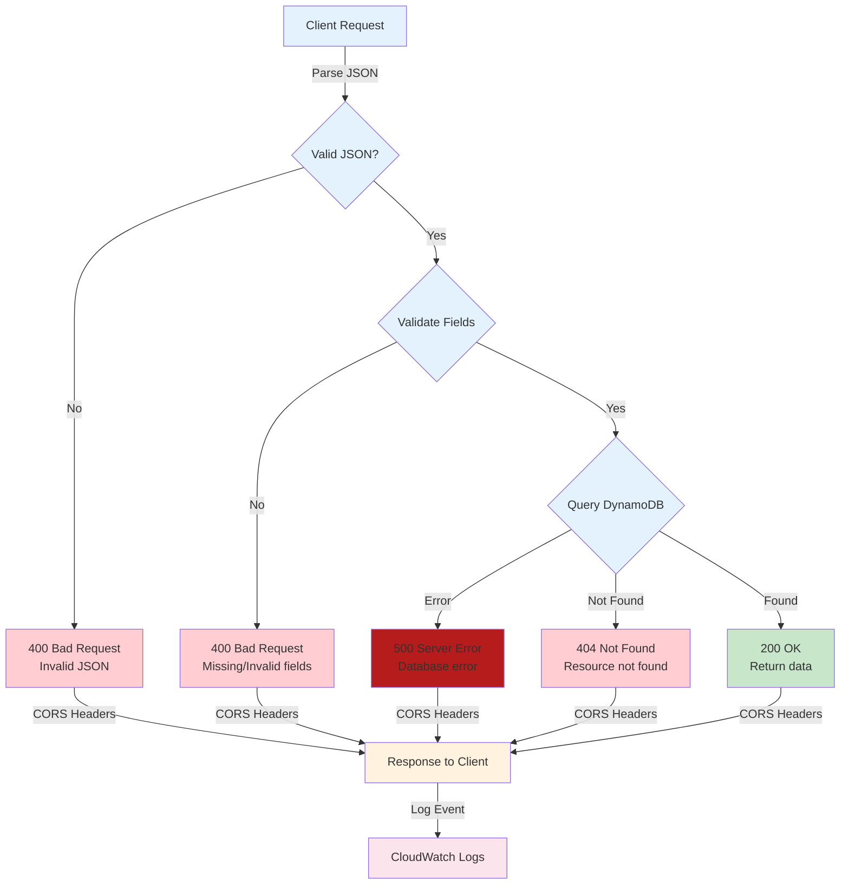

---

## Infrastructure Components

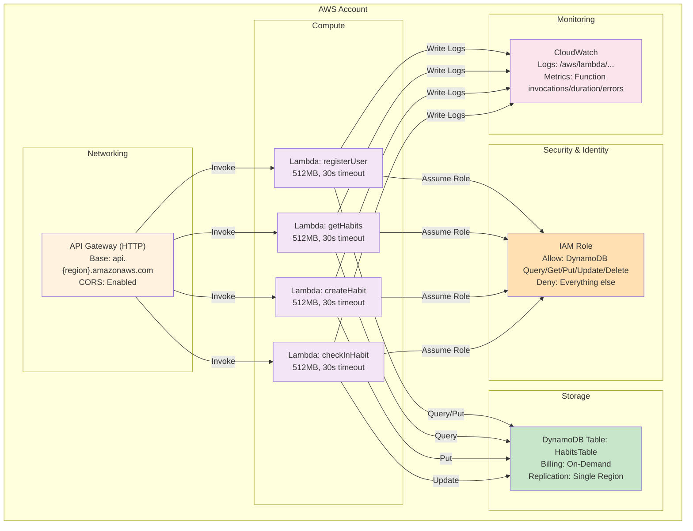

---

**Architecture Version**: 1.0.0  
**Generated**: May 2024
