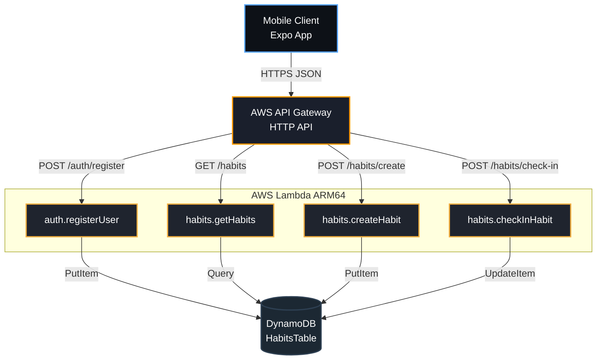

# Habit Tracker - Serverless Backend

A high-performance, low-latency serverless backend optimized to run 100% within the **AWS Lambda** using **TypeScript**, **Serverless Framework (v3)**, and **AWS SDK v3**.

---

## 🏗️ Backend Structure



---

## 🌐 Live API Endpoints

**Base URL:** `https://hg1iywighj.execute-api.ap-south-1.amazonaws.com`

* 🔗 [`POST` /auth/register](https://www.google.com/search?q=https://hg1iywighj.execute-api.ap-south-1.amazonaws.com/auth/register)
* Initial onboarding footprint creation.
* *Payload:* `{ "userId": "usr_7s", "email": "dev@example.com", "timezone": "Asia/Kolkata" }`


* 🔗 [`GET` /habits](https://www.google.com/search?q=https://hg1iywighj.execute-api.ap-south-1.amazonaws.com/habits)
* Retrieves all user habits for the masonry layout.
* *Headers:* `Authorization: Bearer <userId>`


* 🔗 [`POST` /habits/create](https://www.google.com/search?q=https://hg1iywighj.execute-api.ap-south-1.amazonaws.com/habits/create)
* Appends a new habit card.
* *Payload:* `{ "title": "Gym", "cardHeight": 210, "colors": ["#FF0844", "#FFB199"] }`


* 🔗 [`POST` /habits/check-in](https://www.google.com/search?q=https://hg1iywighj.execute-api.ap-south-1.amazonaws.com/habits/check-in)
* Atomic execution update layer handling streaks and progress increments.
* *Payload:* `{ "habitId": "hab_101" }`


* 🔗 [`PATCH` /habits/{habitId}](https://www.google.com/search?q=https://hg1iywighj.execute-api.ap-south-1.amazonaws.com/habits/{habitId})
* Update habit metadata (title, cardHeight, colors).
* *Payload (any of):* `{ "title": "New title", "cardHeight": 180, "colors": {"primary":"#FFF","secondary":"#000"} }`

* 🔗 [`DELETE` /habits/{habitId}](https://www.google.com/search?q=https://hg1iywighj.execute-api.ap-south-1.amazonaws.com/habits/{habitId})
* Remove a habit for the given user.
* `userId` must be provided via query param, request body or auth claims.

Example curl commands
```bash
# Patch habit
curl -X PATCH "https://<api>/habits/abc123?userId=550e8400-e29b-41d4-a716-446655440000" \
    -H "Content-Type: application/json" \
    -d '{"title":"Evening Walk","cardHeight":160}'

# Delete habit
curl -X DELETE "https://<api>/habits/abc123?userId=550e8400-e29b-41d4-a716-446655440000"
```


---
